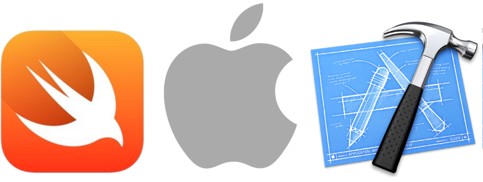

# Demo Swift Hello World

This demonstration shows:

  * [Swift](http://swift.org) programming language with
    [Apple](http://apple.com)
    [Xcode](https://developer.apple.com/xcode/)
    [iOS](http://www.apple.com/ios/)

  * How to create a view that shows "Hello World" on the screen.

There are multiple git branches so pick the one you want:

  * swift-4-xcode-9: Swift version 4, Xcode version 9, iOS version 11.

  * swift-3-xcode-8: Swift version 3, Xcode version 8, iOS version 10.

To use this project:

  * You can clone this repo.

  * Or you can create the project yourself by using this README that explains how to do it.

## Create the project

Launch Xcode. 

Choose "File" → "New" → "Project". 

You see the dialog "Choose a template for your new project".

  * Choose the "iOS" radio button.

  * Choose the "Single View Application" icon.

  * Tap the button "Next".

You see the dialog "Choose options for your new project".

  * For "Product Name", type "Demo Swift Hello World".

  * For "Organization Name", type anything you want. Typically this is your company's name, or team's name, or similiar. For example, "Example Company".

  * For "Organization Identifier", type anything you want. Typically this is your company's reverse domain name. For example, "com.example".

  * Tap the button "Next".

You see the file chooser.

  * Choose where to save your project.

  * Tap the button "Create".

  * Xcode creates the project.

## Sign the project

If Xcode shows a "Signing" area with a "Status" alert icon, here's how to solve it.

  * Xcode may show a message such as "Signing for "Demo Swift Hello World" requires a development team. Select a development team in the project editor."

  * In the same "Signing" section, choose the "Team" dropdown, and choose your Apple ID.

  * If there's no Apple ID, then you need to add yours: Xcode → Preferences → Accounts → the "+" button → Add Apple ID

## Run the project

Run the project for the first time.

  * Xcode → Product → Run

  * This is simply to verify that the project runs so far.

The Simulator launches.

  * The Simulator shows a blank screen.

  * Quit the Simulator and go back to using Xcode.

## Create the label

Open the view.

  * In the left Xcode column, Tap the icon "Main.storyboard".

  * In the next Xcode column, Tap the icon "View Controller Scene", then "View Controller", then "View".

  * In the central Xcode column, you see the "View Controller" layout area, and the view box is all blue, which means it is selected.

Add a label.

  * In the lower-right Xcode area, there is a library picker, with four icons that have rollover tool tips: "Show the File Template library", "Show the Code Snippet library", "Show the Object library", "Show the Media library".

  * Tap the circle icon "Show the Object Library".

  * Scroll until you see the "Label" item.

  * Drag-and-drop the "Label" item to the middle of the View Controller layout area.

  * Double-tap the label to edit the text; edit the text to say "Hello World".

## Center the label

Center the label by adding constraints.

  * Control-tap-press the label, and drag right. This pops up a menu. Choose "Center Vertically in Container"

  * Control-tap-press the label, and drag down. This pops up a menu. Choose "Center Horizontally in Container"

Update.

  * In the central Xcode column, in the lower right area, tap the icon that is a refresh circle arrow, with the tool tip "Update Frames".

  * The text field resets to its constraints, which make it the correct size, and center it in the view.

## Run

Run the project.

  * Xcode → Product → Run

The Simulator launches.

  * The Simulator shows "Hello World".

  * Congratulations! You're successful!
  

## Tracking

* Package: demo_swift_hello_world
* Version: 3.0.0
* Created: 2016-04-09
* Updated: 2017-09-18
* License: BSD, GPL, MIT
* Contact: Joel Parker Henderson (http://joelparkerhenderson.com)
